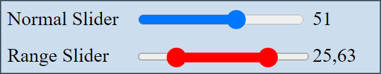

# What

A range selection slider using Web Components that can be used like a regular html element called ```<range-select>```

Note: It's hacked together and serves my purposes, but might not be robust to edge-cases and unintented usage.


<p align="center">
	
</p>

[Try out the slider here.](https://potree.org/permanent/RangeSelect/)

# Usage

### Use the custom <range-select> element 

	<range-select id="sldRange"></range-select>


### Import RangeSelect module (importing automatically registers the component)

	<script type="module">
		import {RangeSelect} from "./RangeSelect.js"

	</script>


### Set values and listener

	let rangeSelect = document.getElementById("sldRange");
	rangeSelect.setRange(13, 76);
	rangeSelect.setValue(20, 50);

	rangeSelect.addEventListener("input", (e) => {
		console.log(e.target.value);
	});

# References

https://stackoverflow.com/a/31083391/913630